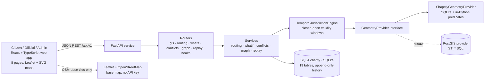
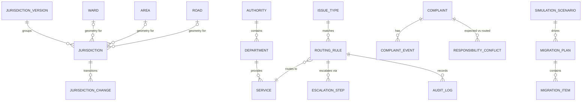

# Architecture

[← Back to README](../README.md)

## System Diagram

**Key idea:** business logic talks only to the `GeometryProvider` interface.
Swapping the demo Shapely engine for PostGIS later requires no changes above
the DI boundary.

## Request Walkthrough

Trace one real request end-to-end — `POST /api/v1/routing/resolve`:

1. Client sends the selected routing point (`latitude`, `longitude`), an
   `issue_type_code` and the `on_date` being asked about.
2. The routing router validates the payload through a Pydantic v2 schema;
   invalid coordinates or unknown issue types return the structured
   `{ "error": { "code", "message", "details" } }` envelope.
3. The `TemporalJurisdictionEngine` queries every `jurisdictions` row whose
   closed-open validity window `[effective_from, effective_to)` contains the
   date (NULL `effective_to` = open ended), then the configured
   `GeometryProvider` runs the point-in-polygon predicate.
4. The routing decision table matches the issue type + jurisdiction scope and
   returns the authority → department → service chain, escalation path and the
   matched rule code; ties are surfaced as `RESPONSIBILITY_UNRESOLVED`.
5. An append-only `audit_logs` row records the decision.
6. The response returns jurisdiction, boundary version, authority/department/
   service, the matched rule, an explanation and a routing status
   (`RESOLVED` / `RESPONSIBILITY_UNRESOLVED` / `NO_JURISDICTION` /
   `INVALID_COORDINATES`).

The same decision is reused (never duplicated) by the responsibility graph
(P6) and the historical replay (P7); the what-if simulator and the migration
preview call it inside read-only sessions that are rolled back.

## Components

| Component | Responsibility | Tech | Code location |
|---|---|---|---|
| Frontend app | 8-page UI over the API; dashboard, citizen routing (Leaflet map + geolocation), explorer/replay (SVG maps), what-if, migrations, conflicts, graph | React 18 · TS 5 · Vite 5 · react-router 6 · Leaflet | `frontend/src` |
| API layer | Routers + Pydantic schemas for every capability | FastAPI · Pydantic v2 | `backend/app/api` |
| Services | Routing, what-if, conflict detection, graph, replay, migration preview logic | Python | `backend/app/{routing,whatif,conflicts,graph,replay}` |
| Temporal GIS engine | Version-window lookup, overlap detection, boundary transition handling | Shapely + Python | `backend/app/gis/temporal_engine.py` |
| Geometry provider | Interface + Shapely (SQLite file store) implementation; CRS ops via pyproj | Shapely 2 · pyproj · geopandas | `backend/app/gis/shapely_provider.py` |
| Data store | 19-table relational model, SQLite file-backed demo DB; append-only history | SQLAlchemy 2 | `backend/app/db` |
| Deterministic seed | Synthesises the Mysuru-scale demo scenario offline | Python (fixed RNG) | `backend/app/seed/seed_runner.py` |

## Data Model

19 tables across reference data, jurisdiction, routing, complaints, analysis
and audit. Jurisdiction rows are **never mutated or deleted** — a boundary
change inserts a new row and records a `jurisdiction_changes` transition.

| Entity | Notes |
|---|---|
| `jurisdiction_versions` | Coherent boundary snapshots (`DELIM-2020` superseded, `DELIM-2024` current, `DELIM-2026` proposed) with `CURRENT / PROPOSED / SUPERSEDED` status |
| `jurisdictions` | Versioned polygons with closed-open `[effective_from, effective_to)` windows; geometry stored as WKB |
| `jurisdiction_changes` | `CREATED / MODIFIED / SUPERSEDED` transitions between versions |
| `wards`, `areas`, `roads` | Named locality model for the civic mosaic (9 wards, 3 areas, 4 roads) |
| `authorities`, `departments`, `services` | Responsibility hierarchy (5 authorities, 10 departments, 13 services) |
| `routing_rules`, `escalation_steps` | Temporal, scoped decision table (25 rules) + escalation paths |
| `issue_types` | 21-code registry incl. legacy/expired codes |
| `complaints`, `complaint_events` | 9 synthetic complaints + lifecycle events |
| `responsibility_conflicts` | Persisted jurisdiction-vs-routing findings (P5) |
| `simulation_scenarios`, `migration_plans`, `migration_items` | Read-only what-if + migration preview state |
| `audit_logs` | Append-only audit for routing/admin actions |

Temporal semantics: validity windows are closed-open `[effective_from,
effective_to)`; `NULL` `effective_to` means "open ended". Past versions stay
queryable forever, so "when did responsibility change here?" is a lookup, not
a reconstruction.

## Key APIs

Versioned under `/api/v1`:

| Method | Endpoint | Purpose |
|---|---|---|
| `GET` | `/health` | App / database / seed / geometry-engine status |
| `GET` | `/gis/jurisdictions` · `/gis/jurisdictions/{id}` | List + detail jurisdictions (date, kind, version, geometry filters) |
| `POST` | `/gis/lookup` | Temporal point lookup `{lat, lng, on_date}` → `MATCHED` / `NO_JURISDICTION` / `TEMPORAL_CONFLICT` / `INVALID_*` |
| `POST` | `/gis/validate-geometry` · `/gis/repair-geometry` | GeoJSON validation / repair used by uploads |
| `POST` | `/gis/describe` · `/gis/operations` · `/gis/transform` | Geometry analysis, spatial algebra, CRS reprojection |
| `GET` | `/gis/wards` · `/gis/areas` · `/gis/roads` | Ward / area / road lookups |
| `POST` | `/routing/resolve` | P2 responsibility decision (authority/department/service + explanation + audit id) |
| `GET` | `/whatif/scenarios` · `/whatif/scenarios/{code}` | List / detail proposed scenarios |
| `POST` | `/whatif/scenarios` | Create a deterministic DRAFT scenario from GeoJSON |
| `POST` | `/whatif/simulate` | Read-only live-vs-proposed simulation |
| `GET` | `/whatif/scenarios/{code}/migration-preview` | Which OPEN complaints would change responsibility (read-only) |
| `GET` | `/conflicts` · `/conflicts/{id}` | Detected conflict list / detail |
| `POST` | `/conflicts/detect` | Deterministic, idempotent detection run |
| `GET` | `/graph/resolve` | Explanatory responsibility chain for one point + issue + date |
| `GET` | `/replay/point` | Chronological replay of one point + issue across a date range |

All errors use one envelope: `{ "error": { "code", "message", "details" } }`.

## Tech Stack

| Layer | Choice | Why this over alternatives |
|---|---|---|
| Frontend | React 18 + TypeScript 5 + Vite 5, plain CSS custom properties, react-router 6 | Fast, type-safe SPA; zero UI-framework lock-in; ships as static files behind nginx |
| Maps | Leaflet + OpenStreetMap (routing) · SVG fit-to-viewBox (explorer/replay) | No Google, no API keys, offline-tolerant, full control of the jurisdiction overlay |
| Backend | FastAPI + Pydantic v2 + Uvicorn | Async, OpenAPI out of the box, strict validation on every input |
| Database | SQLite via SQLAlchemy 2 (file-backed demo store) | Zero-setup deterministic demo; PostGIS-ready schema behind the ORM |
| Geometry | Shapely 2 via `GeometryProvider` ABC; pyproj/geopandas for CRS + ops | Swap to PostGIS `ST_*` with one config flag — business logic untouched |
| Temporal engine | In-Python version-window resolution | Deterministic and testable; no extra infra |
| AI / ML | **None at runtime** (see [ai.md](../ai.md)) | Every decision is a pure, explainable function of data |
| Hosting | Docker Compose: backend + nginx static frontend reverse-proxying `/api` | One-command demo stack with a persistent named volume |

## Data Sources

| Dataset | Source & licence | Real or synthetic | Used for |
|---|---|---|---|
| Ward / area / road boundaries | Self-generated, **SYNTHETIC DEMO DATA - NOT OFFICIAL MYSURU BOUNDARIES** | Synthetic (deterministic seed) | All GIS lookups, routing, replay, what-if |
| Routing rules & issue types | Self-authored demo registry (Mysuru-scale) | Synthetic | P2–P7 decisions |
| Complaints & conflicts | Deterministic seed (fixed RNG) | Synthetic | Demo, replay, migration, conflicts |
| OSM base map tiles | OpenStreetMap tile servers (usage-policy-compliant base imagery) at runtime | Real, external (frontend only) | Visual base layer under locally-drawn overlays |